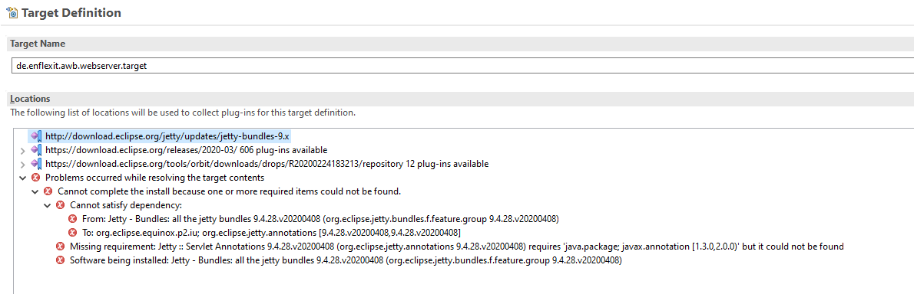
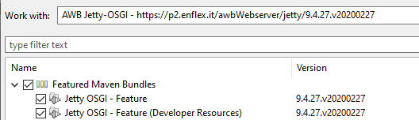

# Jetty OSGI - Feature for Target Platforms 

### Problem Description
Integrating Jetty in an Eclipse RCP / OSGI environment (or application) seems to be not trivial. Simply integrating the 
[Jetty p2 repository](http://download.eclipse.org/jetty/updates/jetty-bundles-9.x) (see [Eclipse site](https://www.eclipse.org/jetty/download.html)) 
in your target platform definition results to errors that say that required packages, or bundles respectively, can not be found:

  

The reason seems to be that only the Jetty bundles are provided but not the required pure java *.jar files like **javax.annotation-api_1.2.0.jar** 
and others (?) or that they are available, but not as OSGI bundles. However, to use Jetty in your RCP / OSGI application, it would be preferable 
to have all Jetty parts as OSGI bundles concluded in a single feature for the usage within a target platform definition in Eclipse.

### Things we tried
Searching Google, Stack Overflow and the Eclipse Community Forum. Asking in the issue section of the [jetty.project](https://github.com/eclipse/jetty.project)
at GitHub and finally, giving up the search for several month. 

In the meantime we used the Jetty bundles that are provides by the current release in the Eclipse repository (e.g. https://download.eclipse.org/releases/2020-03/), but
here not all Jetty bundles are available - such as osgi.boot, XML, WebApp bundles and other. Those bundles we downloaded from the maven repository or used the bundles
that are provided with the Jetty distribution (see <https://repo1.maven.org/maven2/org/eclipse/jetty/jetty-distribution/>).      
Unfortunately, we end up in an unsightly mixture of repository files and local files that were manually copied to a project directory.
This directory again were used within the target platform definition, which always resulted to errors when starting Eclipse and resolving the target platform.
This again required to *Reload* the local directory and  Reload of the Target Platform - ugly!   

### The latest approach 
Through another project we recognized the [p2-maven-plugin](https://github.com/reficio/p2-maven-plugin). This Maven plugin "tries to bridge the gap between 
Maven-like and RCP-like dependency management styles so that all Maven features can be seamlessly used with "No Fear!"". For this, it downloads all required
dependencies to a folder, check if these are OSGI bundles (if not, they will be bundled by using 'bnd' tools) and finally puts them together into a p2 repository 
or update site. 

This tool was used to collect all dependencies and bundles that are described in the [Jetty Documentation for Frameworks](https://www.eclipse.org/jetty/documentation/current/framework-jetty-osgi.html). Further, the projects pom file was customized to create an individual 
**category.xml** file for the p2 site. Additionally, the **wagon-maven-plugin** of the MojoHaus Project was added to be able to upload the created repository
by using a ssh connection.  

As result, we are able to create a p2 update site containing the above mentioned Jetty OSGI bundle structure as a coherent feature. Additionally, the source code 
is provided in an supplementary feature.

  

### Execution of the projects pom 
To use the approach, you should have look into the pom first. Here you will find a couple of properties that simplifies the configuration and usage.
For example: you can specify the Jetty version you would like to use or the directory in which you would like to place the created repository.
Further, you will find configuration options that allow you to upload the update site to your domain.     
   
To execute the pom, you have basically two options:

**1. To build the repository locally, run the Maven build by using**

```
mvn clean p2:site
```
or, if you are using Eclipse, right click on the *pom.xm* and select *'Run As'* => *'Maven Build ...'* and 
type **clean p2:site** into the *Goals* section. 


**2. To build the repository locally and upload the repository, run Maven by uisng ** 

```
mvn clean p2:site install -P p2DeployClean
```
or, if you are using Eclipse, right click on the *pom.xm* and select *'Run As'* => *'Maven Build ...'* and 
type **clean p2:site install** into the *Goals* section. Additionally, type **p2DeployClean** into the *Profile* field!   


